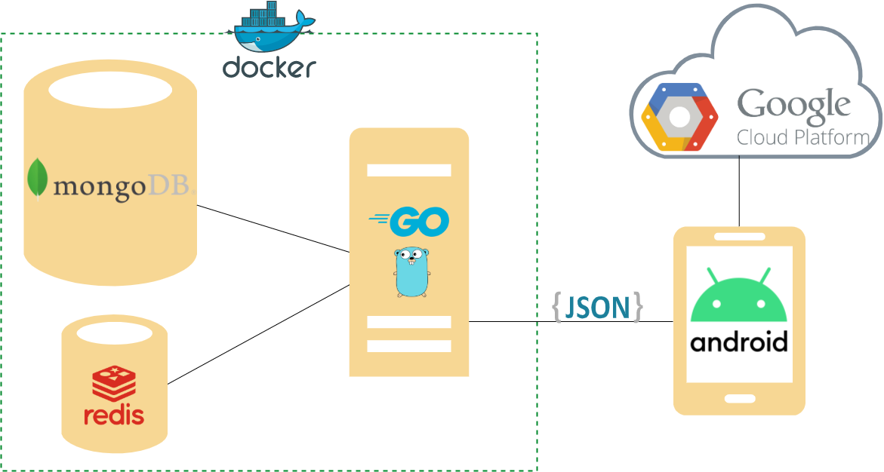

# Mobile application that facilitates traveling byelectric cars (thesis work)

# Aplikacja mobilna ułatwiająca podróżowanie samochodami elektrycznymi (praca inżynerska)

### Full documetation is avaible on: [./Documetation/W04_245816_2020_praca_inżynierska.pdf](https://github.com/Despenrado/ElCharge/W04_245816_2020_praca_inżynierska.pdf)

## Intro

This project will solve the problem of finding charging stations for electric vehicles. It is a mobile application in which the user can not only quickly and conveniently search for charging stations that match him, but also add new ones that are not yet in the system. This would allow you to create a self-sufficient application that does not require a large investment to maintain the infrastructure. The app was designed to create comments and evaluate charging stations for electric vehicles. For the convenience of the search, a map was used. In addition to the charging station, the user's position should also be marked on the map.

## Architecture



Used technologies:

- Go (golang): gorilla/mux, dgrijalva/jwt-go, mongo-driver, go-redis/redis
- MongoDB
- Redis
- Android Studio: Java SDK 8, Gradle, RxJava2, OkHttp3 + Retrifit, gms
- Docker (docker-compose)

## Installation and Running

### Build and run RestAPI

```
./RestAPI/docker-compose build
./RestAPI/docker-compose up
```

### Build and run AndroidUI

Copy `/ElCharge/AndroidUI/app/build/outputs/apk/debug/elCharge.apk` on your device and install it. Run `TestApp` application.
